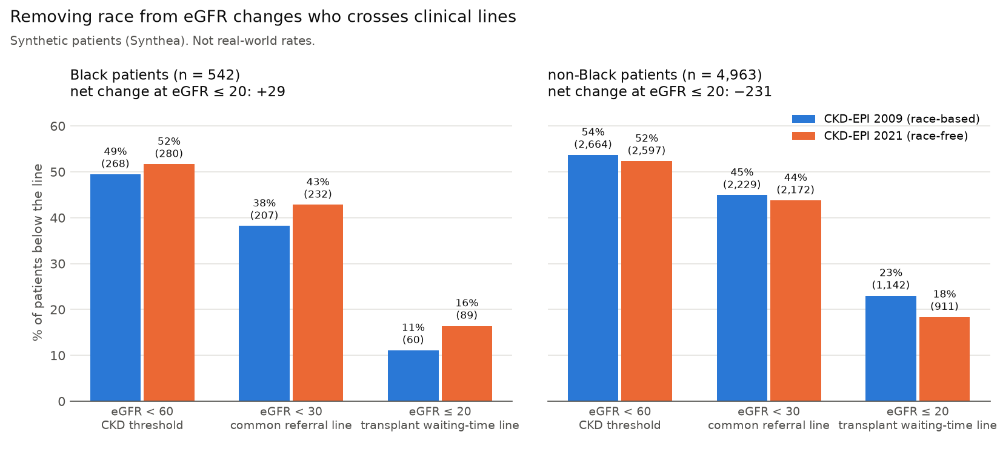
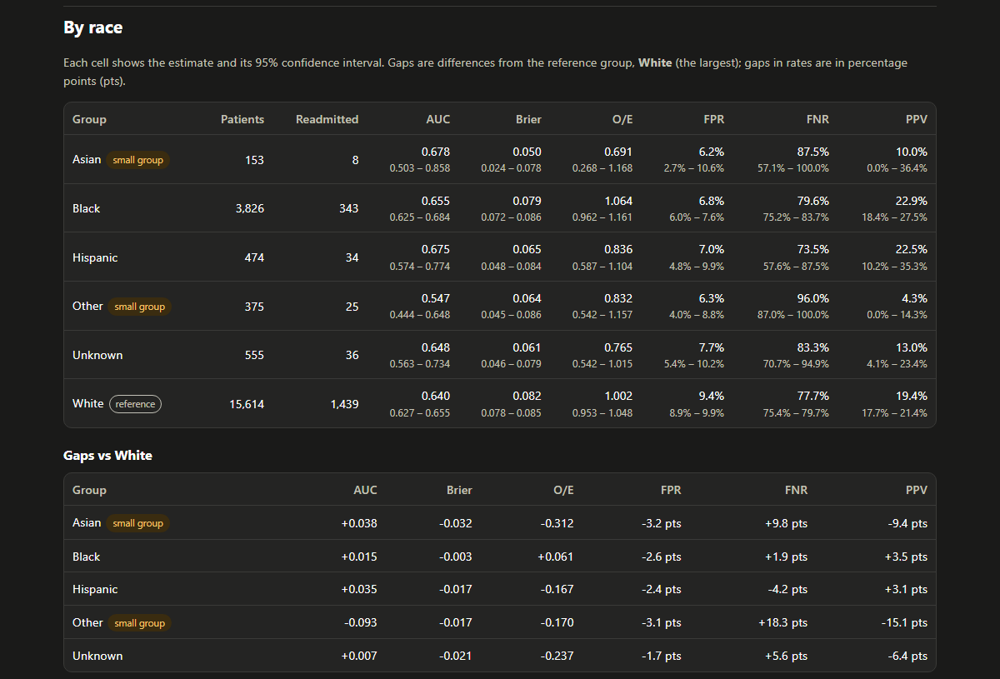
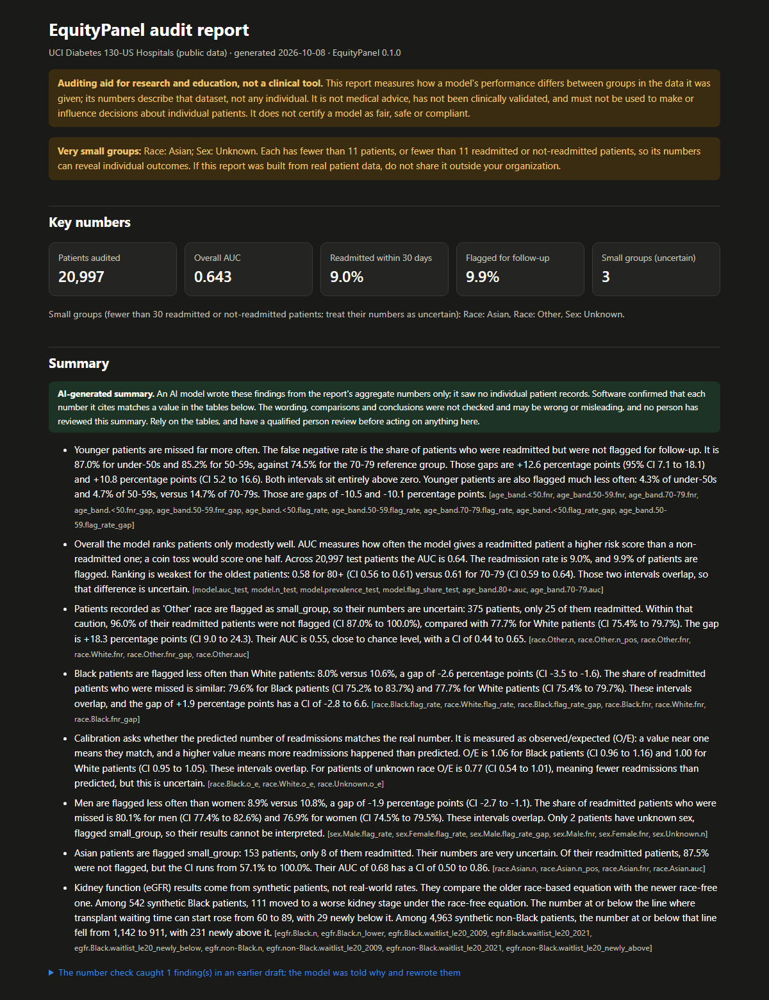
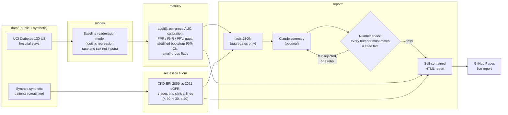

# EquityPanel

[](https://github.com/Whis101/EquityPanel/actions/workflows/ci.yml)

**EquityPanel measures how a clinical risk model's performance differs across race, sex and age,
and explains the results in plain English with an optional AI summary whose numbers are
automatically matched to the computed results (its wording is not checked).**

**[Interactive demo](https://equitypanel.streamlit.app/)** · **[Live audit report](https://whis101.github.io/EquityPanel/)** ·
**Demo video:** _link added at
submission_ · Built for ForgeHacks Online 2026 (AI + Healthcare track)

> **Intended use: research and education.** EquityPanel produces dataset-level statistics; its
> outputs describe groups of patients, not individuals. It is **not medical advice and not a
> medical device**, has not been clinically validated or reviewed by any regulator, and must not
> be used to make or influence decisions about individual patients. Its eGFR equations are
> computed only to count how a cohort moves across thresholds, never to estimate an individual's
> kidney function or guide referral, dosing or transplant decisions. It reports performance gaps;
> it does not certify a model as fair, safe or compliant. The public demo uses only public or
> synthetic data. See [Disclaimers](#disclaimers).

## Headline: removing race from the kidney formula changes who reaches the transplant line



Until 2021 the standard kidney-function formula (CKD-EPI 2009 eGFR) multiplied a Black patient's
result by 1.159, which made their kidneys look healthier. On **5,505 synthetic adults
(Synthea), not real patients**, EquityPanel recomputes everyone with the race-free 2021 formula
and counts who crosses a line where care changes:

- **Black patients:** every one gets a lower eGFR. 111 of 542 move to a worse stage, and those at
  **eGFR ≤ 20, where kidney-transplant waiting time can start, rise from 60 to 89 (+29)**. All 29
  sat just above 20 under the old formula.
- **Non-Black patients** move the other way (1,142 → 911 at ≤ 20), because the 2021 formula was
  re-fitted for everyone. The 2021 authors describe this as a trade-off.

The direction matches the real world, but these synthetic counts are **not** real-world rates.
For scale, real numbers:

- From 2023 to mid-2025, the US transplant network credited **21,119 Black candidates** with
  waiting time lost to the race-based formula, a median of **1.7 years** each (Khazanchi et al.,
  *JAMA Internal Medicine*, published online March 2026; figures as reported by
  [Healio](https://www.healio.com/news/nephrology/20260429/waittime-policy-tied-to-increased-kidney-transplant-rates-for-black-candidates)).
- The 2021 paper projected US Black adults with eGFR < 60 rising from 2.08M to 2.72M under the
  new formula ([Inker et al., NEJM 2021](https://doi.org/10.1056/NEJMoa2102953)).
- As of March 2023, about a third of US labs had still not switched to the race-free formula
  ([Health Affairs](https://www.healthaffairs.org/content/forefront/addressing-harmfully-slow-uptake-race-neutral-kidney-function-tests)).

Both formulas use the published coefficients (checked against the original papers and NIDDK),
and our 2021 formula reproduces all 8 of the National Kidney Foundation's
[published test cases](https://kidney.org/sites/default/files/example_it_ticket-implement_2021_ckd-epi_equation_to_calculate_egfr_from_creatinine_1.pdf).

## Readmission model audit (public UCI data)

A baseline model predicts 30-day hospital readmission for 69,990 diabetic patients
([UCI Diabetes 130-US Hospitals](https://archive.ics.uci.edu/dataset/296/diabetes+130-us+hospitals+for+years+1999-2008)).
Race and sex are **not** model inputs. On the 20,997 held-out test patients (AUC 0.64, in line
with published models on this data), the top 10% by risk are flagged for follow-up. The audit
finds:

- **Younger patients are missed most.** Of readmitted patients under 50, 87.0% were not flagged,
  against 74.5% for ages 70–79: a gap of +12.6 percentage points (95% CI 7.1 to 18.1).
- **"Other" race:** 96.0% of readmitted patients were missed, but only 25 were readmitted, so
  EquityPanel flags the group as small and its numbers as uncertain.
- **Black vs White:** no clear gap in missed readmissions (79.6% vs 77.7%, overlapping CIs) or
  in calibration (observed/expected 1.06 vs 1.00).

[](https://whis101.github.io/EquityPanel/)

## How the AI works

There are two AI parts, and EquityPanel treats both with suspicion:

1. **The model being audited:** a logistic regression readmission model. The audit measures, for
   every group, how well it ranks patients (AUC), whether its risks are calibrated
   (observed/expected), and who it misses (false negative rate). Every estimate has a stratified
   bootstrap 95% confidence interval, and groups too small to trust are flagged rather than
   dropped.
2. **The plain-English summary (optional):** an LLM (Claude, `claude-opus-5-5`, via the
   Anthropic API) writes the findings at the top of the report. It never sees individual patient
   records, only a JSON of aggregate numbers, each with an ID such as `race.Black.fnr`. Each
   finding must cite the IDs it uses, and **EquityPanel matches every number in every sentence**
   to those facts, as written or as a percentage, at the precision shown. Sentences that fail are
   rejected, the model is told why, and the report lists what was rejected. The check covers
   numbers only: the wording, comparisons and conclusions are not checked, so the report tells
   readers to rely on the tables. Without an API key the report still builds, just without the
   summary.
3. **Privacy safeguards before anything is sent:** groups with fewer than 11 patients, readmitted
   or not-readmitted patients are removed from the payload first (with one more group where
   needed, so a hidden group can't be recovered by subtraction), following the US federal
   small-cell convention. The exact payload is saved and shown, and nothing is sent until you
   confirm.

The number check is strict on purpose. In the published report, the model's first draft explained
AUC with "0.5 is chance"; that's true, but it's not one of the computed results, so the check
refused it and the model rewrote the sentence. The check also refuses numbers the model computes
itself, so every number in the summary is one the audit produced.

[](https://whis101.github.io/EquityPanel/)

## Quickstart

Python 3.11+. Data files are never committed; download them into `data/raw/` (gitignored):

- UCI [`diabetic_data.csv`](https://archive.ics.uci.edu/dataset/296/diabetes+130-us+hospitals+for+years+1999-2008) → `data/raw/`
- Synthea [10k CSV export](https://github.com/synthetichealth/synthea-sample-data/tree/main/downloads)
  (`patients.csv`, `observations.csv`) → `data/raw/synthea/`

```bash
pip install -e ".[model,report,llm]"
python scripts/audit_uci.py          # train the baseline model, audit it  -> outputs/
python scripts/egfr_synthea.py       # eGFR 2009 vs 2021 on Synthea        -> outputs/
python scripts/build_report.py       # HTML report  -> outputs/uci_report.html
python scripts/build_report.py --llm # ... with the checked summary (ANTHROPIC_API_KEY in .env)
streamlit run demo/app.py            # the interactive demo (needs the [demo] extra)
```

**Audit your own model** (needs only numpy + pandas, plus `[report]` for the HTML):

```python
import pandas as pd
from equitypanel.metrics.audit import audit
from equitypanel.report.html import build_report

scores = pd.read_csv("scores.csv")  # y_true (0/1), y_score (0-1), plus group columns
result = audit(scores, ["race", "sex", "age_band"], threshold=0.3)
with open("my_report.html", "w", encoding="utf-8") as f:
    f.write(build_report(result.metrics, result.calibration))
```

## Architecture



| Package | What it does |
|---|---|
| `equitypanel.data` | Loaders for UCI and Synthea, and schema checks for every data frame |
| `equitypanel.metrics` | Per-group metrics, calibration, stratified bootstrap CIs, `audit()` |
| `equitypanel.model` | Baseline readmission model (scikit-learn, optional `[model]` extra) |
| `equitypanel.reclassification` | CKD-EPI 2009 and 2021 eGFR, stages, clinical lines, chart |
| `equitypanel.thresholds` | Threshold sweep: each group's error rates as the flagging cutoff moves |
| `equitypanel.report` | Facts JSON, checked LLM summary, charts, HTML report |
| `demo/app.py` | Interactive Streamlit demo on bundled public and synthetic data (no uploads, no AI calls) |

**Quality:** 557 tests (pytest) on Windows and Ubuntu with Python 3.11 and 3.13, Ruff lint and
format checks, and a CI check that fails if any data file or `.env` is committed.

## Built during ForgeHacks

ForgeHacks Online 2026 ran from Oct 3, 12:00 PM EDT to Oct 10. Before it, this repo had only the
scaffold: packaging, tooling, schema validation, the two data loaders and CI. To be
conservative, everything up to the [`pre-hackathon`](https://github.com/Whis101/EquityPanel/tree/pre-hackathon)
tag (Oct 3, 4:29 PM) counts as pre-event work, even though part of it was done after the event
started.

**Built during the event:** per-group metrics and bootstrap CIs, the baseline model and UCI
audit, eGFR reclassification, the HTML report, the checked LLM summary, GitHub Pages hosting, the threshold sweep and interactive demo, and
this README. See every change: **[pre-hackathon...main](https://github.com/Whis101/EquityPanel/compare/pre-hackathon...main)**.

## Limitations and responsible use

- **The eGFR result uses synthetic patients**, who are far sicker than a real population, so the
  counts show the mechanism, not real-world rates.
- **One dataset, one model.** The UCI data is from 1999–2008 US hospitals; results may not hold
  elsewhere.
- **Labels can be biased too.** Readmission depends on access to care, so a model can look
  calibrated against a biased outcome.
- **Small groups** are flagged rather than dropped, and their numbers are uncertain.
- **The summary's wording is not checked**, only its numbers; the tables underneath are the
  source of truth.
- The audit describes gaps; it does not explain their causes or make a model fair.

## Disclaimers

- **Not medical advice or a medical device.** EquityPanel and its reports are for research,
  education and model auditing. They are not medical advice, diagnosis or treatment. The software
  has not been clinically validated or cleared by the FDA or any other regulator. Do not use it to
  make or change decisions about any individual patient.
- **Intended use.** A research and education tool that produces dataset-level statistics. Its
  outputs describe groups, not people, and are estimates with uncertainty. The eGFR equations are
  computed only to count cohort reclassification; never use them to estimate an individual's
  kidney function or to make referral, dosing or transplant decisions.
- **Not a fairness or compliance certification.** A report describes measured gaps on the data
  it was given. A small or non-significant gap does not show that a model is fair, safe or
  unbiased, and a gap does not by itself show its cause. 45 CFR 92.210 (HHS Section 1557)
  requires covered health programs to make reasonable efforts to identify and mitigate the risk
  of discrimination from patient care decision support tools; EquityPanel can support that
  review and does not determine compliance with it or any other law.
- **Real patient data.** The public demo and the hosted report use only public (UCI) and
  synthetic (Synthea) data. If you audit real patient data, run EquityPanel locally inside your
  organization, under its data-governance, privacy and security rules (for example HIPAA in the
  US, or the GDPR in the EU and UK), with any approvals they require. You, not this project, are
  the covered entity or data controller. Never commit data files, and **never publish a report
  built from real patient data, including on GitHub Pages.**
- **What leaves your machine.** EquityPanel has no telemetry. The audit, the report and the eGFR
  module run locally and send nothing over the network. Only the optional summary (`--llm`) sends
  data out: aggregate counts, rates and intervals (no patient rows, no dataset name) go to the
  Anthropic API under Anthropic's terms, which allow retention of API data for up to 30 days.
  Aggregates are **not automatically de-identified** under HIPAA: a group of two patients can
  reveal their outcomes. `--llm` therefore removes groups with 1 to 10 patients or events by
  default (`--min-cell 11`), shows and saves the exact payload, and asks before sending. On real
  patient data, use `--llm` only with your organization's approval and, in the US, a signed and
  enabled Anthropic Business Associate Agreement (standard Messages API only); in the EU or UK,
  a data processing agreement and a valid transfer mechanism. `--allow-small-cells` turns
  suppression off and is meant for public or synthetic data only.
- **AI-generated content.** The optional summary is written by a large language model. Software
  matches each number it cites to the computed results, but its wording, comparisons and
  conclusions are not checked and may be wrong or misleading, and no person reviews it. Do not
  rely on its statements without checking them against the tables, and have a qualified person
  review before acting on anything in it.
- **Synthetic results.** The eGFR results come from synthetic Synthea patients. They show how the
  formula change moves patients across clinical lines; they are not estimates of real-world rates.
- **Race and sex** are used as audit variables to measure differences in model performance, not
  as biological categories or model inputs.
- **Third-party data and figures.** Neither dataset is included in this repository; download
  them from their sources and follow their terms.
  - *Readmission data:* Clore J, Cios K, DeShazo J, Strack B (2014). Diabetes 130-US Hospitals
    for Years 1999-2008 [Dataset]. UCI Machine Learning Repository.
    https://doi.org/10.24432/C5230J. Licensed under
    [CC BY 4.0](https://creativecommons.org/licenses/by/4.0/); EquityPanel's results are
    aggregated and modified from it. Related paper: Strack B, et al. *BioMed Research
    International*, 2014.
  - *Synthetic patients:* Synthea sample data
    ([synthea-sample-data](https://github.com/synthetichealth/synthea-sample-data), no license
    stated), generated by [Synthea](https://github.com/synthetichealth/synthea) (The MITRE
    Corporation, Apache 2.0). Walonoski J, et al. *JAMIA* 2018;25(3):230-238.
    https://doi.org/10.1093/jamia/ocx079.
  - Real-world figures quoted in this README come from the cited sources and are reproduced as
    reported.
- **Privacy of the hosted report.** The GitHub Pages site sets no cookies and runs no analytics
  or scripts. GitHub logs visitor IP addresses under its own privacy statement.
- **No affiliation.** EquityPanel is an independent project. It is not affiliated with or
  endorsed by Anthropic, the National Kidney Foundation, the American Society of Nephrology, the
  UCI Machine Learning Repository, the Synthea project or MITRE, the OPTN, any journal or news
  outlet cited here, or ForgeHacks. Product and organization names belong to their owners.
- **No warranty.** The software is provided "as is", without warranty of any kind, under the MIT
  License. To the extent permitted by law, the authors are not liable for any claim, damages or
  other liability arising from the software or its output. See [LICENSE](LICENSE).
- This section is not legal advice. Organizations should consult their own counsel before using
  EquityPanel with real patient data.

## Development

```bash
python -m venv .venv
source .venv/Scripts/activate   # Windows Git Bash; on macOS/Linux: source .venv/bin/activate
pip install -e ".[dev]"
pytest
ruff check . && ruff format --check .
```

## License

MIT. See [LICENSE](LICENSE).
